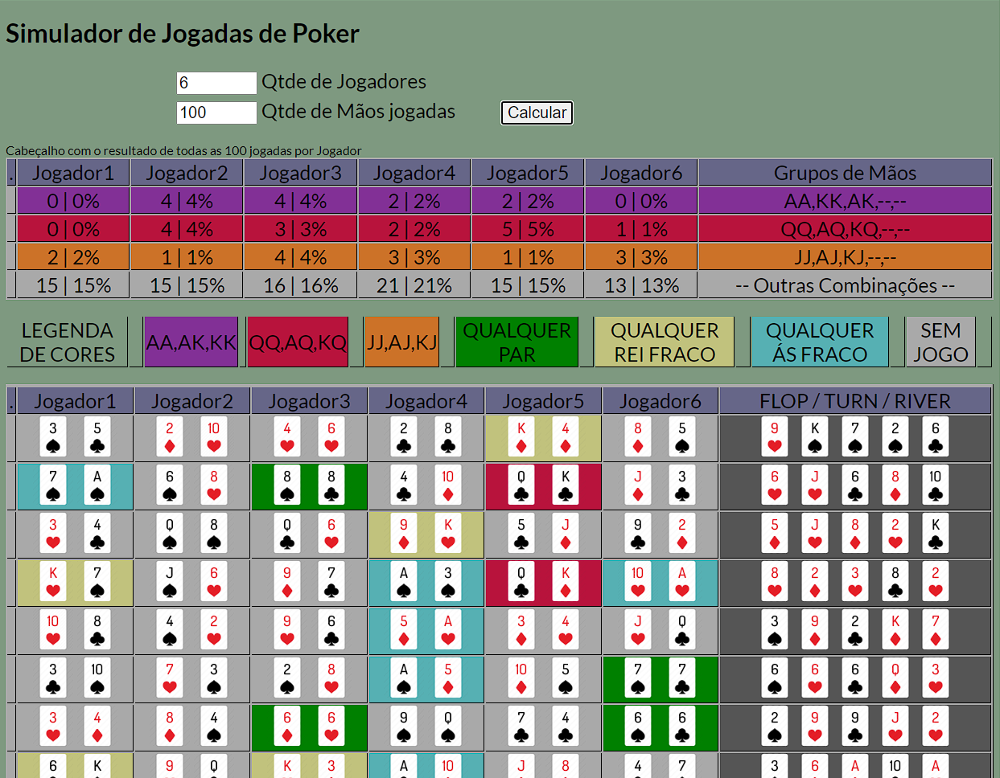

Com uma QUESTIONÁVEL folha de estilos, (que parece ter saido do windows 95), afirmo que confio na programação por trás deste 'TREM'.

Programação essa que, contém:
<ul><li>Uma função para criação de um baralho de cartas em formato de Array. 'IniciaVariavel()' com 52 cartas!</li>
<li>Uma função para embaralhar essa array ou seja as 'cartas'.  'embaralha()'</li>
<li>Uma função que 'calcula()' todas as jogadas.</li>
		Nessa função verifico uma por uma as mãos que receberam os jogadores hipotéticos.
		A essa 'Mão' (de cada jogador) é atribuída uma COR de acordo com a força da mesma.
		(A legenda de cor está apresentada, e os GRUPOS de cartas, são razoavelmente os que constam na literatura comum do jogo de "Poker No Limit Texas Hold'em")

Ao fim de Simular todas as jogadas, sintetizo uma tabela de resultados que é na verdade o Cabeçalho da página

