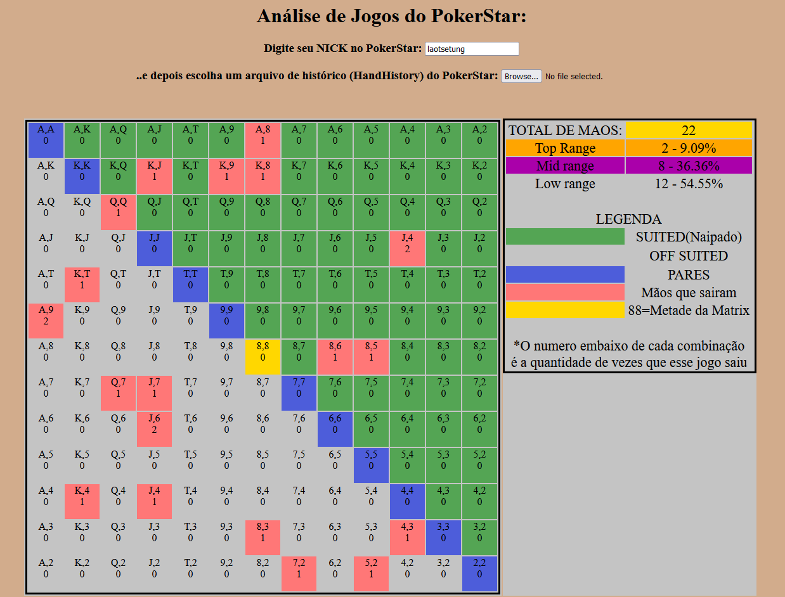

<h1>Aplicação que analisa HandHistory do PokerStar</h1>

Uso:
<ul><li> Colocar o seu nick na caixa de texto indicada </li>
  <li> Clicar no botão "Browse..." e escolher o HandHistory na pasta do PokerStar </li>
  </ul>
  
 Este aplicativo então desenha uma tabela de Range e marca em VERMELHO CLARO quais foram as mãos que sairam para você nesse torneio. 
 Em baixo ela apresenta o HandHistory na integra 
 
 GG GL HF
 
 
